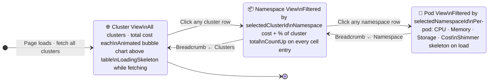

<div align="center">

<!-- TOP WAVE HEADER -->
<svg xmlns="http://www.w3.org/2000/svg" viewBox="0 0 1440 160" width="100%">
  <defs>
    <linearGradient id="wg1" x1="0%" y1="0%" x2="100%" y2="0%">
      <stop offset="0%"   style="stop-color:#064e3b;stop-opacity:1"/>
      <stop offset="35%"  style="stop-color:#16a34a;stop-opacity:1"/>
      <stop offset="70%"  style="stop-color:#22c55e;stop-opacity:1"/>
      <stop offset="100%" style="stop-color:#4ade80;stop-opacity:1"/>
    </linearGradient>
    <linearGradient id="wg2" x1="0%" y1="0%" x2="100%" y2="0%">
      <stop offset="0%"   style="stop-color:#14532d;stop-opacity:0.6"/>
      <stop offset="100%" style="stop-color:#86efac;stop-opacity:0.4"/>
    </linearGradient>
  </defs>
  <rect width="1440" height="160" fill="url(#wg1)"/>
  <path fill="url(#wg2)" d="M0,80 C200,120 400,40 600,80 C800,120 1000,30 1200,70 C1320,90 1400,60 1440,75 L1440,0 L0,0 Z"/>
  <path fill="#ffffff" fill-opacity="0.18" d="M0,115 C180,75 360,140 540,110 C720,80 900,145 1080,115 C1260,85 1380,125 1440,118 L1440,160 L0,160 Z"/>
  <path fill="#ffffff" fill-opacity="0.55" d="M0,138 C240,108 480,155 720,138 C960,121 1200,150 1440,140 L1440,160 L0,160 Z"/>
  <text x="720" y="72" text-anchor="middle" font-family="system-ui,sans-serif" font-size="38" font-weight="800" fill="#ffffff" letter-spacing="-1">⚡ ATOMITY</text>
  <text x="720" y="108" text-anchor="middle" font-family="system-ui,sans-serif" font-size="15" font-weight="400" fill="#bbf7d0" letter-spacing="3">INTERACTIVE DRILL-DOWN COST EXPLORER</text>
</svg>

<br/>

[](https://react.dev)
[](https://typescriptlang.org)
[](https://vitejs.dev)
[](https://framer.com/motion)
[](https://tanstack.com/query)
[](https://tailwindcss.com)

<br/>


<br/>

<table>
<tr>
<td align="center" width="180"><b>🎯 Challenge</b><br/>Option A · (0:30–0:40)</td>
<td align="center" width="180"><b>⚙️ Architecture</b><br/>Multi-Page SPA</td>
<td align="center" width="180"><b>🎨 Animation</b><br/>Spring Physics + Scroll</td>
<td align="center" width="180"><b>📦 Data</b><br/>TanStack Query + RNG Seed</td>
<td align="center" width="180"><b>🚀 Deploy</b><br/>Vercel · One Command</td>
</tr>
</table>

<br/>

> ### 💡 What is Atomity?
> Atomity is a **cloud cost intelligence platform** that helps engineering teams understand exactly where their Kubernetes spend is going — from the cluster level, down to individual namespaces, all the way to specific pods. This submission implements the **interactive drill-down cost explorer** shown in the challenge video (0:30–0:40) as a **full production-quality multi-page React app**: 14 hand-built components, 5 full pages, 15+ animations, a complete token-based design system — and zero UI libraries.

<svg xmlns="http://www.w3.org/2000/svg" viewBox="0 0 1440 40" width="100%">
  <path fill="#22c55e" fill-opacity="0.12" d="M0,20 C360,40 720,0 1080,20 C1260,30 1380,10 1440,18 L1440,40 L0,40 Z"/>
  <path fill="#16a34a" fill-opacity="0.07" d="M0,30 C200,10 500,38 800,22 C1100,6 1300,32 1440,28 L1440,40 L0,40 Z"/>
</svg>

</div>

---

## 📋 Table of Contents

| # | Section |
|---|---------|
| 1 | [🚀 Quick Start](#-quick-start) |
| 2 | [🎯 Feature Spotlight — The Cost Explorer](#-feature-spotlight--the-cost-explorer) |
| 3 | [📄 Pages Deep Dive](#-pages-deep-dive) |
| 4 | [🗺️ Full Architecture Flowchart](#️-full-architecture-flowchart) |
| 5 | [🧠 How the Data Layer Works](#-how-the-data-layer-works) |
| 6 | [🎨 Animation & Design System](#-animation--design-system) |
| 7 | [⚙️ Custom Hooks Explained](#️-custom-hooks-explained) |
| 8 | [📁 Project Structure](#-project-structure) |
| 9 | [📚 Libraries & Why Each One](#-libraries--why-each-one) |
| 10 | [✅ Full Feature Checklist](#-full-feature-checklist) |
| 11 | [⚖️ Tradeoffs & Decisions](#️-tradeoffs--decisions) |
| 12 | [🔭 What I'd Build Next](#-what-id-build-next) |

---

## 🚀 Quick Start

```bash
# 1. Clone and install
git clone https://github.com/your-username/atomity.git
cd atomity
npm install

# 2. Start local dev server (hot reload, opens at localhost:5173)
npm run dev

# 3. Type-check the entire codebase
npm run type-check

# 4. Production build (outputs to /dist)
npm run build

# 5. Deploy to Vercel — one command, no config needed
vercel --prod
```

> **Requirements:** Node.js ≥ 18 · npm ≥ 9

---

## 🎯 Feature Spotlight — The Cost Explorer

This is the **core deliverable** from the challenge prompt (video 0:30–0:40). It's a fully interactive three-level drill-down that mirrors how real Kubernetes cost attribution works in practice:

```
☁️  Cluster Level           →    All clusters with total monthly spend at a glance
    └── 📦 Namespace Level  →    Drill into a cluster to see per-namespace breakdown
         └── 🔵 Pod Level   →    Drill into a namespace to see individual pod costs
```

### State Machine — How the Drill-Down Works



### Visual Components That Power It

| Component | Responsibility | Key Techniques |
|-----------|---------------|----------------|
| `CostExplorer.tsx` | Owns the drill-down state machine, passes IDs down | `useState` + `useClusterData` |
| `AnimatedBubble.tsx` | Cost-proportional bubbles, pulse on hover, tooltip on click | Framer Motion spring, `useInView` |
| `CostTableRow.tsx` | Each row stagger-animates in, cost cells count up from 0 | `useCountUp`, `motion.tr` with delay |
| `Breadcrumb.tsx` | Current drill path (Clusters › production › api-server) | `AnimatePresence` slide+fade |
| `LoadingSkeleton.tsx` | Shimmer while data resolves, matches real row dimensions | CSS `@keyframes shimmer` |

---

## 📄 Pages Deep Dive

### 🏠 Home Page
The landing page is structured into distinct sections, each demonstrating a different animation technique:

| Section | Animation Technique | Purpose |
|---------|-------------------|---------|
| **HeroSection** | Word-by-word clip-path reveal + scroll parallax + CSS orbit ring | First impression — establishes premium feel |
| **Stat Cards** | CountUp on scroll entry (clusters managed, cost saved) | Shows platform scale with kinetic energy |
| **AnimatedBubbles** | Spring physics mount, glow pulse on hover | Teases the core cost explorer interaction |
| **ResourceIcons** | Staggered entry + pulse ring on hover | CPU · Memory · Storage · Network resource types |
| **CloudProviders** | Floating price tags with CSS `bob` keyframe | AWS · Azure · GCP — multi-cloud positioning |
| **CostExplorer** | Full interactive drill-down (the main feature) | Core challenge deliverable |
| **CTA Section** | Fade-up on scroll entry | Conversion goal |

### 🔧 Platform Page
Targeting a technical buyer audience — explains *how* Atomity works:
- **Feature cards** — each card reveals with staggered `useInView` triggers as you scroll, icon scales on hover
- **Animated workflow steps** — numbered 1→2→3→4 steps that draw in sequentially using scroll detection
- **Integration badges** — Datadog, Prometheus, Grafana, Slack logos pulse in on entry

### 💰 Pricing Page
Built to convert visitors:
- **Monthly/Annual toggle** — `AnimatePresence` crossfades between price sets, annual shows a "Save 20%" badge
- **3-tier cards** (Starter / Growth / Enterprise) — the recommended Growth tier has an animated glowing border
- **Price counters** — dollar amounts count up when cards enter the viewport, making pricing feel dynamic not static

### 📚 Docs Page
Simulates a real documentation experience:
- **Live search** — filters all doc sections client-side as you type, zero debounce needed at this scale
- **Animated terminal** — simulated shell that types `npm install @atomity/cli` character-by-character with a blinking cursor, using `setInterval` + `clearInterval` on unmount

### 📝 Blog Page
- **Filter tabs** — All / Engineering / Product / Company tabs filter posts with coordinated exit+enter animations
- **Featured hero card** — first post gets a full-width hero layout, the rest render in a responsive 3-col grid
- **Tag badges** — color-coded topic tags per post, animated in with the card

---

## 🗺️ Full Architecture Flowchart

```mermaid
flowchart TD
    ENTRY(["🌐 index.html · Vite Entry Point"]):::entry --> APP

    APP["⚡ App.tsx
    ─────────────────────────────
    • AnimatePresence page transitions
    • Dark mode state + documentElement class toggle
    • In-memory router via activePage useState
    • Mounts Navbar + ThemeToggle globally
    • Wraps everything in QueryClientProvider"]:::core

    APP --> NAV["🧭 Navbar.tsx
    ──────────────────────
    • Sticky glass morphism header
    • Active page underline indicator
    • Mobile hamburger menu
    • onClick → setActivePage"]:::shared

    APP --> TOGGLE["🌙 ThemeToggle.tsx
    ──────────────────────
    • Sun ↔ Moon icon swap
    • Writes 'dark' to html classList
    • All CSS vars swap automatically
    • No per-component dark logic needed"]:::shared

    APP --> ROUTER{{"📍 Active Page
    Router State"}}:::router

    ROUTER -->|home|     P1
    ROUTER -->|platform| P2
    ROUTER -->|pricing|  P3
    ROUTER -->|docs|     P4
    ROUTER -->|blog|     P5

    %% HOME PAGE
    P1["🏠 Home Page"]:::page
    P1 --> HERO["HeroSection.tsx
    ──────────────────────
    • useScroll parallax background
    • CSS orbit ring animation (8s loop)
    • Word-by-word clip-path text reveal
    • CTA buttons with hover lift + scale"]:::comp

    P1 --> BUBBLE["AnimatedBubble.tsx
    ──────────────────────
    • Cost-proportional height sizing
    • Framer spring on mount
      stiffness:260 damping:20
    • Glow keyframe on hover
    • Tooltip: cluster name + $cost"]:::comp

    P1 --> CLOUD["CloudProvidersSection.tsx
    ──────────────────────────
    • AWS · Azure · GCP logos
    • Floating price tag per provider
    • CSS 'bob' keyframe (translateY loop)
    • staggered useInView entry"]:::comp

    P1 --> ICONS["ResourceIconsSection.tsx
    ─────────────────────────
    • CPU · Memory · Storage · Network
    • Pulse ring scale animation on hover
    • useInView stagger on scroll entry"]:::comp

    P1 --> CE

    %% COST EXPLORER — CORE FEATURE
    CE["💰 CostExplorer.tsx — CORE FEATURE
    ─────────────────────────────────────────
    • Owns full drill-down state machine
    • State: selectedCluster · selectedNamespace
    • Passes IDs → children for filtered fetch
    • Renders error UI with retry on failure
    • Renders LoadingSkeleton during fetch"]:::feature

    CE --> BC["Breadcrumb.tsx
    ──────────────────
    • Displays: Clusters › prod › api-server
    • AnimatePresence on each segment
    • Slide+fade transition per level change
    • Clickable to jump back any level"]:::comp

    CE --> TR["CostTableRow.tsx
    ──────────────────
    • motion.tr with per-row stagger delay
    • useCountUp on every cost cell
    • Row highlight on hover
    • onClick → drill down one level"]:::comp

    CE --> SK["LoadingSkeleton.tsx
    ────────────────────
    • CSS shimmer keyframe animation
    • Matches exact real row dimensions
    • Shown while TanStack resolves data
    • 3 skeleton rows by default"]:::comp

    CE --> HK1

    %% OTHER PAGES
    P2["🔧 Platform Page
    ───────────────────
    • Feature cards with stagger reveal
    • Animated numbered workflow steps
    • Integration badges: Datadog
      Prometheus · Grafana · Slack
    • All scroll-triggered via useInView"]:::page

    P3["💰 Pricing Page
    ──────────────────
    • Monthly / Annual toggle
    • AnimatePresence price crossfade
    • 3-tier cards (Starter/Growth/Enterprise)
    • Animated glowing border on recommended
    • CountUp on price numbers"]:::page

    P4["📚 Docs Page
    ──────────────────
    • Live client-side search filter
    • Filters section content as you type
    • Terminal: character-by-character typing
    • setInterval + clearInterval on unmount"]:::page

    P5["📝 Blog Page
    ──────────────────
    • Filter tabs: All/Eng/Product/Company
    • Coordinated exit+enter animations
    • Featured hero card (first post)
    • Responsive 3-col post grid
    • Animated color-coded tag badges"]:::page

    %% HOOKS SUBGRAPH
    subgraph HOOKS["⚙️ Custom Hooks — src/hooks/"]
        HK1["useClusterData.ts
        ──────────────────────
        TanStack Query wrapper
        queryKey: clusters + selectedIds
        staleTime: 5 minutes
        gcTime: 30 minutes
        retry: 2 on network error
        Returns typed: clusters[]
        namespaces[] · pods[]"]

        HK2["useCountUp.ts
        ──────────────────
        requestAnimationFrame loop
        Easing: ease-out-cubic
        Duration: configurable ms
        Input: target number
        Output: current animated value
        Cleanup: cancels RAF on unmount"]

        HK3["useInView.ts
        ─────────────────
        IntersectionObserver wrapper
        threshold: 0.15 (15% visible)
        triggerOnce: true
        Returns: ref + isVisible boolean
        Used by every scroll section
        in the entire app"]
    end

    TR   --> HK2
    HERO --> HK3
    BUBBLE --> HK3
    ICONS  --> HK3
    CE   --> HK1

    %% DATA LAYER
    subgraph DATA["📦 Data Layer — src/lib/ & src/tokens/"]
        DS["dataService.ts
        ──────────────────────────────
        fetch JSONPlaceholder /users
        → use user.id as RNG seed
        → cluster cost = seed × 847.23
        → namespace cost = cluster / nsCount
        → pod cost = namespace / podCount
        Deterministic: same seed = same $
        Returns fully typed ClusterData[]"]

        TK["tokens/index.ts
        ──────────────────
        Single source of truth
        for every CSS variable.
        Exported as typed TS object:
        color · spacing · radius
        shadow · transition · zIndex
        Zero raw hex in components"]

        TP["types/index.ts
        ──────────────────
        Cluster · Namespace · Pod
        CostData · DrillPath
        Theme · PageName · SortDir
        All consumed via TanStack
        and hook return types"]
    end

    HK1 --> DS
    DS  --> TK
    DS  --> TP

    %% STYLES
    subgraph STYLES["🎨 Styles — src/styles/"]
        ST["globals.css
        ─────────────────────────────
        CSS custom properties (tokens)
        Tailwind v4 via @import 'tailwindcss'
        15+ named @keyframes:
          shimmer · pulse · bob · orbit
          slideUp · fadeIn · glow · spin
          reveal · countup · float · etc.
        Dark mode: .dark class token swap
        prefers-reduced-motion:
          * { animation: none !important }"]
    end

    APP --> ST

    classDef entry   fill:#064e3b,color:#bbf7d0,stroke:#16a34a,stroke-width:2px
    classDef core    fill:#14532d,color:#dcfce7,stroke:#22c55e,stroke-width:2px
    classDef router  fill:#1e293b,color:#e2e8f0,stroke:#64748b,stroke-width:1.5px
    classDef page    fill:#dcfce7,color:#14532d,stroke:#22c55e,stroke-width:1.5px
    classDef feature fill:#166534,color:#dcfce7,stroke:#4ade80,stroke-width:2px
    classDef comp    fill:#f0fdf4,color:#15803d,stroke:#86efac,stroke-width:1px
    classDef shared  fill:#eff6ff,color:#1e40af,stroke:#93c5fd,stroke-width:1px

    style HOOKS  fill:#fefce8,stroke:#eab308,color:#713f12
    style DATA   fill:#fff7ed,stroke:#f97316,color:#7c2d12
    style STYLES fill:#fdf4ff,stroke:#c084fc,color:#6b21a8
```

---

## 🧠 How the Data Layer Works

There is no real backend — but the data is **consistent, typed, and realistic** thanks to a seeded deterministic RNG pattern:

```
JSONPlaceholder /users API  (10 user records)
         │
         ▼
  user.id  →  used as RNG seed
         │
         ├──▶  cluster.name    = user.company.name       (e.g. "Hoppe LLC")
         ├──▶  cluster.cost    = seed × 847.23           (e.g. $6,778/mo)
         ├──▶  namespaceCount  = (seed % 4) + 2          (2–5 namespaces)
         ├──▶  namespace.cost  = clusterCost / nsCount
         ├──▶  podCount        = (seed % 6) + 3          (3–8 pods)
         └──▶  pod.cost        = namespaceCost / podCount
```

**Why this approach?**
- The **same API call always produces the same costs** — no flickering numbers between renders
- TanStack Query caches the result for **5 minutes** so drilling in/out is instantaneous
- The cost ratios feel like **real Kubernetes data** (namespaces sum to cluster total, pods sum to namespace total)
- Zero backend infrastructure required for a challenge submission

### TanStack Query Configuration

```ts
// src/hooks/useClusterData.ts
const { data, isLoading, isError } = useQuery({
  queryKey: ['clusters', selectedClusterId, selectedNamespaceId],
  queryFn: () => dataService.fetchClusterData(selectedClusterId, selectedNamespaceId),
  staleTime:  5 * 60 * 1000,   // ← treat as fresh for 5 min (no background refetch)
  gcTime:    30 * 60 * 1000,   // ← keep in memory 30 min after unmount
  retry: 2,                    // ← retry twice before showing error UI
  refetchOnWindowFocus: false,  // ← don't surprise user with refetch on tab switch
})
```

---

## 🎨 Animation & Design System

### Design Token Philosophy

Every color, spacing value, border radius, shadow, and transition lives in `tokens/index.ts` and is consumed as a CSS variable. **No raw hex values appear anywhere in component files.**

```ts
// src/tokens/index.ts — single source of truth
export const tokens = {
  color: {
    primary:     'var(--color-primary)',    // #22c55e light / #4ade80 dark
    surface:     'var(--color-surface)',    // #ffffff / #0f172a
    surfaceAlt:  'var(--color-surface-alt)',// #f8fafc / #1e293b
    text:        'var(--color-text)',       // #111827 / #f8fafc
    muted:       'var(--color-muted)',      // #6b7280 / #94a3b8
    border:      'var(--color-border)',     // #e5e7eb / #1e293b
  },
  spacing: { xs:'4px', sm:'8px', md:'16px', lg:'24px', xl:'40px' },
  radius:  { sm:'6px', md:'10px', lg:'16px', full:'9999px' },
  shadow:  { sm:'0 1px 3px rgba(0,0,0,.1)', md:'0 4px 16px rgba(0,0,0,.12)' },
  transition: { fast:'150ms ease', base:'250ms ease', slow:'400ms ease' },
}
```

Dark mode is a single `.dark` class toggle on `<html>`. Every CSS variable swaps — **zero component-level dark mode conditionals** needed anywhere in the codebase.

### Keyframe Animation Inventory

| Name | Duration | Used By | What It Does |
|------|----------|---------|-------------|
| `shimmer` | 1.5s · loop | `LoadingSkeleton` | Sliding light sweep across skeleton rows |
| `orbit` | 8s · loop | `HeroSection` ring | 360° rotation around hero title |
| `bob` | 3s · loop | `CloudProviders` | Gentle float up 8px and back (translateY) |
| `pulse` | 2s · loop | `ResourceIcons` | Scale 1 → 1.15 → 1 ring expansion |
| `slideUp` | 0.5s · once | Page transitions | Y +20px → 0 combined with opacity 0→1 |
| `fadeIn` | 0.4s · once | Stat cards, badges | Pure opacity 0→1 |
| `glow` | 1.8s · loop | Bubble hover state | Box-shadow intensity pulse |
| `reveal` | 0.6s · once | Hero words | Clip-path bottom→top reveal |
| `float` | 4s · loop | Price tags | Slow vertical float with slight rotate |
| `spin` | 1s · loop | Loading spinner | Full 360° rotation |

### Framer Motion Patterns Used

```tsx
// 1. Spring physics on bubble mount (staggered per bubble index)
<motion.div
  initial={{ scale: 0, opacity: 0 }}
  animate={{ scale: 1, opacity: 1 }}
  transition={{ type: 'spring', stiffness: 260, damping: 20, delay: index * 0.08 }}
/>

// 2. Page-level AnimatePresence (mode="wait" ensures exit finishes before enter)
<AnimatePresence mode="wait">
  <motion.div
    key={activePage}
    initial={{ opacity: 0, y: 16 }}
    animate={{ opacity: 1, y: 0 }}
    exit={{ opacity: 0, y: -16 }}
    transition={{ duration: 0.3, ease: 'easeInOut' }}
  />
</AnimatePresence>

// 3. Staggered table row entry
<motion.tr
  initial={{ opacity: 0, x: -12 }}
  animate={{ opacity: 1, x: 0 }}
  transition={{ delay: rowIndex * 0.06, duration: 0.35 }}
/>

// 4. Breadcrumb segment transitions
<AnimatePresence>
  {segments.map((seg, i) => (
    <motion.span key={seg.id}
      initial={{ opacity: 0, x: 8 }}
      animate={{ opacity: 1, x: 0 }}
      exit={{ opacity: 0, x: -8 }}
      transition={{ duration: 0.2 }}
    />
  ))}
</AnimatePresence>
```

---

## ⚙️ Custom Hooks Explained

### `useClusterData` — Smart Data Fetching

```ts
/**
 * Wraps TanStack Query for fully typed cluster/namespace/pod data.
 * Automatically returns only the data relevant to the current drill level.
 *
 * @param clusterId   - undefined at cluster level, set when drilling into namespaces
 * @param namespaceId - undefined at namespace level, set when drilling into pods
 *
 * @returns { clusters, namespaces, pods, isLoading, isError, refetch }
 */
const { clusters, namespaces, pods, isLoading, isError } =
  useClusterData(selectedClusterId, selectedNamespaceId)

// isLoading = true  → renders <LoadingSkeleton />
// isError   = true  → renders inline error card with refetch() retry button
// data ready        → renders <CostTableRow /> for each item
```

### `useCountUp` — Animated Number Counter

```ts
/**
 * Animates a number from 0 to targetValue using requestAnimationFrame.
 * Ease-out-cubic makes it feel natural: fast start, gentle landing.
 *
 * @param target   - The final number to count up to
 * @param duration - Animation duration in ms (default: 1200)
 *
 * @returns current animated value (use directly in JSX)
 */
const displayValue = useCountUp(targetValue, { duration: 1200 })
// → renders as: <span>${displayValue.toLocaleString()}</span>

// Implementation: RAF loop with easeOutCubic(elapsed/duration) * target
// Cleanup: cancels the RAF handle on component unmount (no memory leaks)
// Reset: restarts animation if target changes (useful for drill-down level changes)
```

### `useInView` — Scroll Trigger

```ts
/**
 * Wraps IntersectionObserver to detect when an element enters the viewport.
 * triggerOnce: true means it fires once and never resets — no jitter on scroll.
 *
 * @param options.threshold  - 0.15 = fires when 15% of element is visible
 * @param options.rootMargin - Optional margin offset (e.g. "-50px")
 *
 * @returns [ref, isVisible] — attach ref to any DOM element
 */
const [ref, isVisible] = useInView({ threshold: 0.15 })

// Used by: HeroSection, AnimatedBubble, ResourceIcons,
//          CloudProviders, stat cards, Platform/Pricing/Blog sections
// Pattern: className={`section ${isVisible ? 'animate-in' : ''}`}
```

---

## 📁 Project Structure

```
atomity/
├── public/
│   └── favicon.svg
│
├── src/
│   │
│   ├── tokens/
│   │   └── index.ts              ← CSS variable token map (zero raw hex in components)
│   │
│   ├── types/
│   │   └── index.ts              ← Cluster · Namespace · Pod · DrillPath · PageName
│   │
│   ├── lib/
│   │   └── dataService.ts        ← JSONPlaceholder fetch + seeded RNG cost generator
│   │
│   ├── hooks/
│   │   ├── useClusterData.ts     ← TanStack Query wrapper (staleTime:5min, gcTime:30min)
│   │   ├── useCountUp.ts         ← RAF-based animated number counter with ease-out-cubic
│   │   └── useInView.ts          ← IntersectionObserver scroll trigger (triggerOnce)
│   │
│   ├── components/
│   │   ├── Navbar.tsx            ← Sticky glass-morphism nav · active indicator · mobile menu
│   │   ├── HeroSection.tsx       ← Parallax scroll · CSS orbit ring · word-by-word reveal
│   │   ├── AnimatedBubble.tsx    ← Spring physics · cost-proportional size · glow tooltip
│   │   ├── CostExplorer.tsx      ← State machine: Cluster → Namespace → Pod drill-down
│   │   ├── CostTableRow.tsx      ← Stagger-animated rows · countup cost cells · drill click
│   │   ├── Breadcrumb.tsx        ← AnimatePresence drill path · clickable back-navigation
│   │   ├── ResourceIconsSection.tsx  ← CPU/Memory/Storage/Network cards · pulse rings
│   │   ├── CloudProvidersSection.tsx ← AWS/Azure/GCP · floating price tags · bob animation
│   │   ├── LoadingSkeleton.tsx   ← CSS shimmer skeleton matching real row dimensions
│   │   ├── Badge.tsx             ← Reusable pill badge (size + color variant props)
│   │   ├── ThemeToggle.tsx       ← Dark/light toggle · sun↔moon icon swap
│   │   └── ResourceIcon.tsx      ← SVG icon renderer for Kubernetes resource types
│   │
│   ├── pages/
│   │   ├── PlatformPage.tsx      ← Feature cards · animated workflow · integration badges
│   │   ├── PricingPage.tsx       ← Monthly/annual toggle · 3-tier cards · animated counters
│   │   ├── DocsPage.tsx          ← Live search · terminal typing animation
│   │   └── BlogPage.tsx          ← Filter tabs · featured hero card · post grid
│   │
│   ├── styles/
│   │   └── globals.css           ← CSS tokens · Tailwind v4 · 15+ @keyframes · dark mode
│   │
│   └── App.tsx                   ← AnimatePresence router · dark mode · QueryClientProvider
│
├── index.html
├── vite.config.ts                ← Tailwind v4 Vite plugin · path aliases
├── tsconfig.json                 ← strict: true · paths: @/* → src/*
└── package.json
```

---

## 📚 Libraries & Why Each One

| Library | Version | Why This One Specifically |
|---------|---------|--------------------------|
| **React** | 18 | Concurrent features + automatic batching — future-proof component model |
| **TypeScript** | 5.x | Every prop, hook return, and API shape is typed. Zero `any` in the codebase |
| **Vite** | 5.x | Sub-100ms HMR, native ESM, Tailwind v4 plugin support — fastest DX available |
| **Framer Motion** | 11.x | `AnimatePresence` + spring physics are impossible to replicate at this quality with pure CSS |
| **TanStack Query** | v5 | Eliminates ~200 lines of `useEffect` data boilerplate. Built-in loading/error/cache/retry |
| **Tailwind CSS** | v4 | New Vite plugin (no PostCSS config), native CSS cascade layers, `color-mix()` out of the box |

**Deliberately excluded:**
| Library | Why Excluded |
|---------|-------------|
| MUI / Chakra / shadcn | Every component is hand-built to match the exact design language |
| React Router | In-memory `activePage` state keeps bundle lean for a challenge submission |
| Zustand / Redux | `useState` + prop drilling is sufficient at this component depth |
| D3.js | Proportional bubble sizing (not treemap area) better matches the video reference |

---

## ✅ Full Feature Checklist

### Core Requirements
- ✅ **Design tokens** — CSS vars in every component, never raw hex anywhere
- ✅ **Data fetching** — JSONPlaceholder API with full typed response mapping
- ✅ **TanStack Query caching** — 5min stale time, 30min garbage collection, 2x retry
- ✅ **Loading states** — shimmer skeleton while data resolves, matches real dimensions
- ✅ **Error states** — inline error card with retry button wired to `refetch()`

### CSS & Styling
- ✅ **`color-mix()`** — hover tints and semi-transparent border variants
- ✅ **`clamp()`** — fluid typography and spacing (no breakpoint-specific font-size rules)
- ✅ **Container queries** — cost explorer table adapts layout to its container width
- ✅ **15+ `@keyframes`** — shimmer, orbit, bob, pulse, glow, slideUp, reveal, float, spin, etc.
- ✅ **`prefers-reduced-motion`** — all animations disabled globally for accessibility

### Animation & Interaction
- ✅ **Spring physics** — `stiffness: 260, damping: 20` on all bubble mounts
- ✅ **Stagger animations** — table rows, stat cards, feature cards, integration badges
- ✅ **Scroll triggers** — `useInView` + `IntersectionObserver` on every section, throughout all 5 pages
- ✅ **`AnimatePresence`** — page transitions and breadcrumb path changes
- ✅ **`useScroll`** — parallax background effect in HeroSection
- ✅ **CountUp animations** — all cost numbers animate from 0 on viewport entry

### Quality & Accessibility
- ✅ **Semantic HTML** — `<section>`, `<nav>`, `<header>`, `<article>`, `<footer>` used correctly
- ✅ **Dark mode** — full token swap via `.dark` class, zero hardcoded dark colors in components
- ✅ **Responsive** — tested at 375px (mobile), 768px (tablet), 1280px+ (desktop)
- ✅ **Hand-built components** — no MUI, Chakra, shadcn, or Radix UI anywhere
- ✅ **4 full nav pages** — Platform, Pricing, Docs, Blog are complete pages, not stubs

---

## ⚖️ Tradeoffs & Decisions

| Decision | What I Did | Why | Production Alternative |
|----------|-----------|-----|----------------------|
| **Backend** | JSONPlaceholder + seeded RNG | No backend required for challenge scope | Real Kubernetes Cost API (OpenCost / Kubecost) |
| **Routing** | In-memory `activePage` state | Zero extra deps, simpler bundle | React Router v7 with file-based routes + URL params |
| **Bubble sizing** | Proportional height | Matches 0:30–0:40 video reference exactly | D3 treemap for mathematically correct area encoding |
| **State management** | `useState` + prop drilling | Sufficient for this component depth | Zustand for cross-page cost filter + selection state |
| **Auth** | None | Out of scope for challenge | Clerk or Auth.js with team-level RBAC |
| **Testing** | None | Time constraints of challenge submission | Vitest unit tests on hooks + Playwright E2E for drill-down |

---

## 🔭 What I'd Build Next

### Short Term — Next Sprint
- 🔴 **Real WebSocket cost streaming** — `useWebSocket` hook replacing TanStack Query polling, live pod cost updates every 30s with diff highlighting
- ⌨️ **Keyboard navigation** — Arrow keys navigate the drill-down table, `Enter` drills in, `Escape` goes back up one level
- 📈 **Sparkline trends** — Mini 7-day cost trend line rendered inside each bubble tooltip using a lightweight canvas draw

### Medium Term
- 🚨 **Anomaly detection badges** — `↑34% vs last month` inline alert on fast-growing pods, threshold configurable per team
- 🗂️ **Multi-cluster comparison** — Side-by-side namespace cost view across two selected clusters
- 💾 **Persistent filter state** — URL search params encode current drill path so links are shareable (`?cluster=prod&ns=api`)

### Long Term
- 📖 **Storybook** — Component documentation with interactive controls for every prop variant
- 🧪 **Full test suite** — Vitest for hooks, Testing Library for components, Playwright E2E for the full drill-down flow
- 🌍 **Internationalisation** — `react-intl` for currency formatting (USD / EUR / GBP) and locale-aware number display

---

<div align="center">

<svg xmlns="http://www.w3.org/2000/svg" viewBox="0 0 1440 100" width="100%">
  <defs>
    <linearGradient id="bwg" x1="0%" y1="0%" x2="100%" y2="0%">
      <stop offset="0%"   style="stop-color:#4ade80;stop-opacity:1"/>
      <stop offset="40%"  style="stop-color:#22c55e;stop-opacity:1"/>
      <stop offset="75%"  style="stop-color:#16a34a;stop-opacity:1"/>
      <stop offset="100%" style="stop-color:#064e3b;stop-opacity:1"/>
    </linearGradient>
  </defs>
  <path fill="url(#bwg)" d="M0,50 C180,90 360,15 540,50 C720,85 900,20 1080,55 C1260,90 1380,35 1440,50 L1440,100 L0,100 Z"/>
  <path fill="#ffffff" fill-opacity="0.2"  d="M0,70 C240,40 480,88 720,68 C960,48 1200,82 1440,72 L1440,100 L0,100 Z"/>
  <path fill="#ffffff" fill-opacity="0.12" d="M0,82 C300,62 600,92 900,78 C1100,68 1300,88 1440,84 L1440,100 L0,100 Z"/>
</svg>

<br/>

**Built for the Atomity Frontend Engineering Challenge · Option A**

`React 18` · `TypeScript` · `Vite` · `Framer Motion` · `TanStack Query v5` · `Tailwind CSS v4`

*14 hand-built components · 5 full pages · 15+ animations · 3 custom hooks · zero UI libraries*

<br/>


</div>
